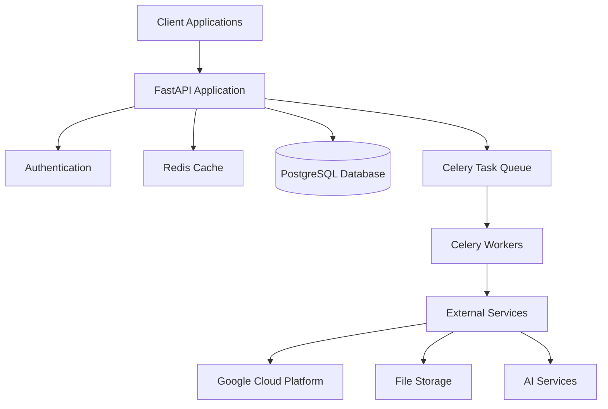
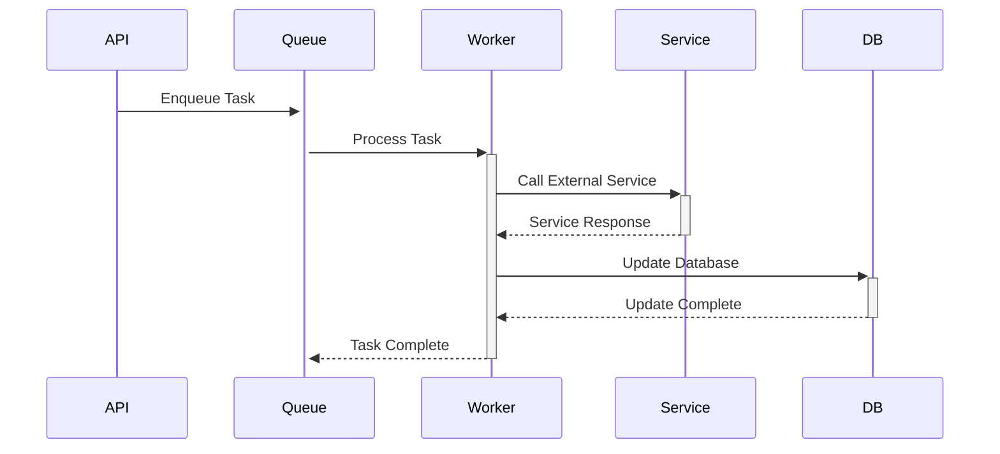

# Architecture Guide 🏗️

Welcome to the architecture guide! This document will help you understand the high-level design of the Imangor API and how its various components work together. Whether you're a junior developer or a senior engineer, this guide will give you a solid foundation for working with our codebase.

## System Overview

The Imangor API is built on a modern, scalable architecture that follows clean architecture principles and domain-driven design. Here's a high-level view of our system:



## Core Components

### 1. API Layer (FastAPI)

Our API layer is built using FastAPI, a modern, fast web framework for building APIs with Python. The API layer is organized into several key directories:

```
app/
├── api/            # API endpoints and routers
├── core/           # Core application configuration
├── crud/           # Database operations
├── models/         # SQLAlchemy models
├── schemas/        # Pydantic models
├── services/       # Business logic and external services
├── tasks/          # Celery tasks
└── middleware/     # Custom middleware
```

#### Key Features:
- Async/await support for high performance
- Automatic OpenAPI documentation
- Request validation using Pydantic
- Dependency injection system
- Middleware for cross-cutting concerns

### 2. Database Layer (PostgreSQL + SQLAlchemy)

We use PostgreSQL as our primary database with SQLAlchemy as our ORM. The database layer is designed with:

- **Models**: SQLAlchemy models in `app/models/`
- **Migrations**: Alembic for database migrations
- **CRUD Operations**: Reusable CRUD operations in `app/crud/`
- **Schemas**: Pydantic models for data validation in `app/schemas/`

#### Database Design Principles:
- Normalized database schema
- Proper indexing for performance
- Soft deletes where appropriate
- Audit trails for critical operations
- Efficient query patterns

### 3. Caching Layer (Redis)

Redis serves multiple purposes in our architecture:

- **API Response Caching**: Frequently accessed data
- **Session Storage**: User sessions and tokens
- **Rate Limiting**: API rate limiting
- **Task Queue**: Message broker for Celery
- **Real-time Features**: Pub/sub for real-time updates

### 4. Task Queue (Celery)

Celery handles asynchronous tasks and background jobs:

- **Task Types**:
  - Long-running operations
  - Scheduled tasks
  - Periodic jobs
  - External service integration
  - File processing
  - Email sending

- **Task Management**:
  - Task prioritization
  - Retry mechanisms
  - Error handling
  - Monitoring and logging

### 5. External Services Integration

We integrate with various Google Cloud Platform services:

- **Cloud Storage**: File storage and management
- **Cloud Vision**: Image analysis
- **Cloud Translate**: Translation services
- **Cloud Speech**: Speech-to-text conversion
- **Other GCP Services**: As needed

## Data Flow

### 1. API Request Flow

```mermaid
sequenceDiagram
    Client->>+API: HTTP Request
    API->>+Middleware: Process Request
    Middleware->>+Auth: Validate Token
    Auth-->>-Middleware: Token Valid
    Middleware->>+Cache: Check Cache
    alt Cache Hit
        Cache-->>-API: Return Cached Data
    else Cache Miss
        Cache->>+DB: Query Database
        DB-->>-Cache: Return Data
        Cache->>Cache: Update Cache
        Cache-->>-API: Return Data
    end
    API-->>-Client: HTTP Response
```

### 2. Background Task Flow



## Security Architecture

### 1. Authentication & Authorization

- JWT-based authentication
- Role-based access control (RBAC)
- OAuth2 integration for third-party services
- API key management for service-to-service communication

### 2. Data Security

- Data encryption at rest
- TLS for data in transit
- Secure password hashing
- Input validation and sanitization
- SQL injection prevention
- XSS protection

## Scalability Considerations

### 1. Horizontal Scaling

- Stateless API design
- Database connection pooling
- Redis cluster for caching
- Celery worker scaling
- Load balancing ready

### 2. Performance Optimization

- Database indexing
- Query optimization
- Caching strategies
- Connection pooling
- Async operations
- Batch processing

## Monitoring and Observability

### 1. Logging

- Structured logging
- Log aggregation
- Log levels and categories
- Request tracing
- Error tracking

### 2. Metrics

- API performance metrics
- Database metrics
- Cache hit rates
- Task queue metrics
- Resource utilization

### 3. Alerting

- Error rate monitoring
- Performance degradation alerts
- Resource exhaustion alerts
- Security incident alerts

## Development Guidelines

### 1. Code Organization

- Follow clean architecture principles
- Use dependency injection
- Implement proper separation of concerns
- Follow SOLID principles
- Write testable code

### 2. Testing Strategy

- Unit tests for business logic
- Integration tests for API endpoints
- End-to-end tests for critical flows
- Performance testing
- Security testing

### 3. Documentation

- API documentation (OpenAPI/Swagger)
- Code documentation
- Architecture documentation
- Deployment documentation
- Security documentation

## Deployment Architecture

### 1. Environment Strategy

- Development
- Staging
- Production
- Feature environments

### 2. Deployment Process

- CI/CD pipeline
- Automated testing
- Blue-green deployment
- Rollback procedures
- Database migrations

## Future Considerations

### 1. Planned Improvements

- Microservices architecture
- Event-driven architecture
- Enhanced monitoring
- Advanced caching strategies
- Performance optimizations

### 2. Scalability Roadmap

- Database sharding
- Service mesh implementation
- Enhanced caching
- Global distribution
- Advanced load balancing

## Need Help?

If you need clarification on any aspect of the architecture:
1. Check the specific component guides
2. Review the code examples
3. Ask in the team's communication channels
4. Schedule an architecture review session

## Contributing to Architecture

We welcome contributions to improve our architecture. Please:
1. Document proposed changes
2. Create architecture review requests
3. Follow our contribution guidelines
4. Consider scalability and maintainability

Happy architecting! 🏗️ 