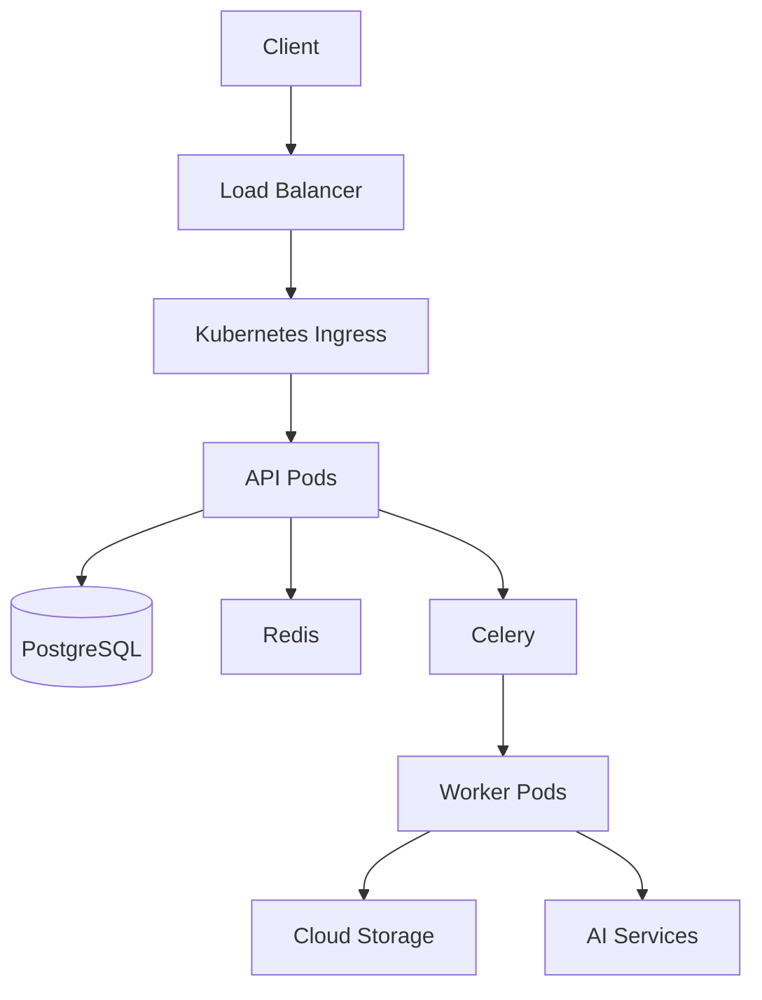

# Deployment Guide 🚀

Welcome to the deployment guide! This document will help you understand our deployment process, infrastructure, and how to deploy the application to different environments. Whether you're deploying to development, staging, or production, this guide will be your companion.

## Table of Contents

1. [Deployment Overview](#deployment-overview)
2. [Environments](#environments)
3. [Infrastructure](#infrastructure)
4. [Deployment Process](#deployment-process)
5. [Monitoring](#monitoring)
6. [Scaling](#scaling)
7. [Security](#security)
8. [Best Practices](#best-practices)

## Deployment Overview

Our application is deployed using a modern, containerized approach with the following components:

- Docker containers for application services
- Kubernetes for orchestration
- Google Cloud Platform for infrastructure
- CI/CD pipeline for automated deployments
- Monitoring and logging solutions

### Deployment Architecture



## Environments

### 1. Development

- Local development environment
- Docker Compose for services
- Hot-reload enabled
- Debug mode active
- Test database

### 2. Staging

- Mirrors production environment
- Automated deployments
- Test data
- Performance monitoring
- Security scanning

### 3. Production

- High availability setup
- Load balancing
- Auto-scaling
- Production database
- Security measures

## Infrastructure

### 1. Google Cloud Platform

#### Compute Resources
- Google Kubernetes Engine (GKE)
- Node pools for different workloads
- Auto-scaling configuration
- Resource quotas

#### Storage
- Cloud SQL for PostgreSQL
- Cloud Storage for files
- Redis for caching
- Backup storage

#### Networking
- VPC configuration
- Load balancing
- Cloud CDN
- Cloud Armor

### 2. Kubernetes Setup

#### Namespaces
```yaml
# k8s/namespaces.yaml
apiVersion: v1
kind: Namespace
metadata:
  name: imangor-api
  labels:
    name: imangor-api
    environment: production
```

#### Deployments
```yaml
# k8s/api-deployment.yaml
apiVersion: apps/v1
kind: Deployment
metadata:
  name: api
  namespace: imangor-api
spec:
  replicas: 3
  selector:
    matchLabels:
      app: api
  template:
    metadata:
      labels:
        app: api
    spec:
      containers:
      - name: api
        image: gcr.io/project/api:latest
        ports:
        - containerPort: 8000
        env:
        - name: DATABASE_URL
          valueFrom:
            secretKeyRef:
              name: app-secrets
              key: database-url
        resources:
          requests:
            memory: "256Mi"
            cpu: "200m"
          limits:
            memory: "512Mi"
            cpu: "500m"
```

#### Services
```yaml
# k8s/api-service.yaml
apiVersion: v1
kind: Service
metadata:
  name: api
  namespace: imangor-api
spec:
  type: ClusterIP
  ports:
  - port: 80
    targetPort: 8000
  selector:
    app: api
```

## Deployment Process

### 1. CI/CD Pipeline

```yaml
# .github/workflows/deploy.yml
name: Deploy

on:
  push:
    branches:
      - main
      - staging

jobs:
  deploy:
    runs-on: ubuntu-latest
    steps:
    - uses: actions/checkout@v2
    
    - name: Set up Docker Buildx
      uses: docker/setup-buildx-action@v1
      
    - name: Build and push
      uses: docker/build-push-action@v2
      with:
        context: .
        push: true
        tags: gcr.io/project/api:${{ github.sha }}
        
    - name: Deploy to GKE
      uses: google-github-actions/deploy-cloudrun@v1
      with:
        credentials: ${{ secrets.GCP_SA_KEY }}
        project_id: ${{ secrets.GCP_PROJECT }}
        image: gcr.io/project/api:${{ github.sha }}
```

### 2. Deployment Steps

1. **Build**
   ```bash
   # Build Docker image
   docker build -t gcr.io/project/api:latest .
   
   # Push to registry
   docker push gcr.io/project/api:latest
   ```

2. **Deploy**
   ```bash
   # Update Kubernetes deployment
   kubectl apply -f k8s/
   
   # Verify deployment
   kubectl rollout status deployment/api -n imangor-api
   ```

3. **Verify**
   ```bash
   # Check pods
   kubectl get pods -n imangor-api
   
   # Check logs
   kubectl logs -f deployment/api -n imangor-api
   ```

## Monitoring

### 1. Metrics

- Prometheus for metrics collection
- Grafana for visualization
- Custom metrics for business KPIs
- Resource utilization monitoring

### 2. Logging

- Cloud Logging integration
- Structured logging
- Log aggregation
- Log retention policies

### 3. Alerting

- Alert rules configuration
- Notification channels
- Incident response procedures
- On-call rotation

## Scaling

### 1. Horizontal Pod Autoscaling

```yaml
# k8s/hpa.yaml
apiVersion: autoscaling/v2
kind: HorizontalPodAutoscaler
metadata:
  name: api
  namespace: imangor-api
spec:
  scaleTargetRef:
    apiVersion: apps/v1
    kind: Deployment
    name: api
  minReplicas: 3
  maxReplicas: 10
  metrics:
  - type: Resource
    resource:
      name: cpu
      target:
        type: Utilization
        averageUtilization: 70
```

### 2. Database Scaling

- Read replicas
- Connection pooling
- Query optimization
- Index management

### 3. Cache Scaling

- Redis cluster
- Cache invalidation
- Cache warming
- Cache monitoring

## Security

### 1. Network Security

- VPC configuration
- Network policies
- SSL/TLS termination
- DDoS protection

### 2. Application Security

- Secrets management
- RBAC configuration
- Security contexts
- Pod security policies

### 3. Data Security

- Encryption at rest
- Encryption in transit
- Backup encryption
- Access controls

## Best Practices

### 1. Deployment

- Use semantic versioning
- Implement blue-green deployments
- Maintain deployment history
- Document deployment procedures
- Test deployment process

### 2. Configuration

- Use environment variables
- Manage secrets properly
- Version control configuration
- Document configuration
- Validate configuration

### 3. Monitoring

- Set up proper alerts
- Monitor resource usage
- Track application metrics
- Monitor security events
- Regular health checks

### 4. Maintenance

- Regular updates
- Security patches
- Database maintenance
- Log rotation
- Backup verification

## Common Tasks

### 1. Rolling Update

```bash
# Update deployment
kubectl set image deployment/api api=gcr.io/project/api:new-version -n imangor-api

# Monitor rollout
kubectl rollout status deployment/api -n imangor-api

# Rollback if needed
kubectl rollout undo deployment/api -n imangor-api
```

### 2. Scaling

```bash
# Scale deployment
kubectl scale deployment api --replicas=5 -n imangor-api

# Check scaling
kubectl get hpa -n imangor-api
```

### 3. Troubleshooting

```bash
# Check pod status
kubectl get pods -n imangor-api

# Check pod logs
kubectl logs -f pod/api-pod-name -n imangor-api

# Check pod events
kubectl describe pod api-pod-name -n imangor-api
```

## Need Help?

If you need assistance with deployment:
1. Check the deployment logs
2. Review the monitoring dashboards
3. Ask in the team's communication channels
4. Schedule a deployment review session

Happy deploying! 🚀 